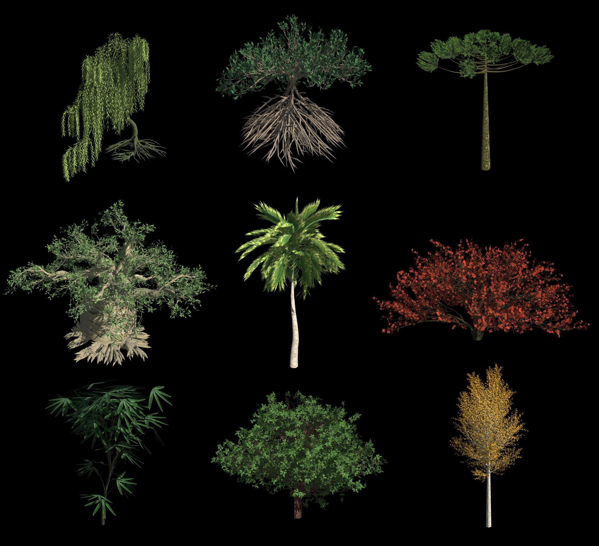

# Procedural Tree Generator
 

A procedural 3D tree generator implementing space-colonization and penn & werber's method. Frontend built with [Three.js](https://threejs.org/). Runs entirely in the browser.
 
**[Live Demo](https://eduardomdc.github.io/trees/)**
 
## Features
 
- **Two generation methods** — switch between the parametric [Weber & Penn](https://dl.acm.org/doi/10.1145/218380.218427) model and [Space Colonization](https://www.researchgate.net/publication/221314843_Modeling_Trees_with_a_Space_Colonization_Algorithm) for organic, irregular canopies
- **Root generation** — procedurally generate root structures using Space Colonization
- **13 tree species presets**
- **Real-time preview** — any parameter change instantly rebuilds and renders the tree
- **Save / Load** — export and import tree configurations
- **Export 3D model** — download the generated tree as a `.glb` file, ready to use in game engines or 3D software